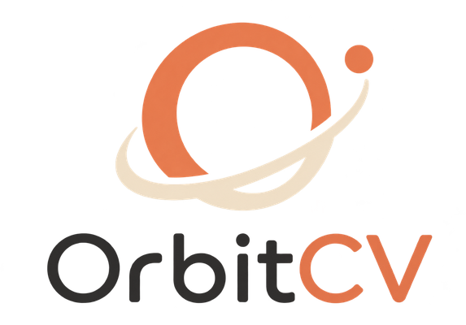

<p align="center">
  
</p>

<p align="center">
  Free, AI-tailored, ATS-safe CVs and cover letters for every country's format.
</p>

<p align="center">
  
  
  
</p>

---

Most resume builders assume a single (usually US) CV format and charge a subscription. **OrbitCV** is free, format-aware, and built for job seekers applying across borders, starting with Nepal and expanding to major international standards.

## Features

- **Region-aware CV formats**: 9 built-in profiles (Nepal, UK, Germany/EU, Europass, Finland, France, Australia, Canada, and general international), each following that region's real conventions: photo or no photo, nationality field, date format, length norms.
- **AI Smart Tailor**: paste a job description and let AI select and reframe the most relevant experience from your full master CV into a verified one-page, ATS-safe version, without inventing anything not already in your CV.
- **AI cover letter generation**: generates a tailored cover letter from your CV and the job description, correctly addressing the actual employer by name.
- **Real-text PDF export**: CVs and cover letters export as selectable, ATS-parseable PDFs (never flattened images), with automatic page-count verification.
- **Bring-your-own-key or shared AI**: use your own Gemini/OpenRouter key for unlimited generations, or a small daily free tier with no key required.
- **Zero infrastructure cost**: built to run entirely on free tiers.

## Tech stack

| Layer     | Choice                          |
|-----------|----------------------------------|
| Frontend  | React + Vite + TypeScript        |
| Backend   | Supabase (Postgres, Auth, RLS)   |
| AI        | Gemini / OpenRouter               |
| PDF       | `@react-pdf/renderer` + `pdf-lib` |
| Hosting   | Vercel (free tier)                |

## Getting started

```bash
git clone https://github.com/IAZENT/OrbitCV.git
cd OrbitCV
npm install
cp .env.example .env   # fill in your Supabase project keys
npm run dev
```

## License

This is a personal, proprietary project. Not licensed for reuse or redistribution.
